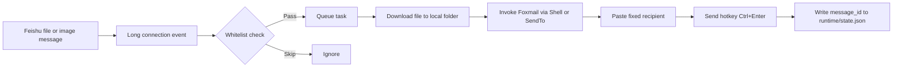

# Feishu File Mailer


把飞书收到的文件或图片消息，自动转成 Foxmail 发件动作的 Windows 工具。

这个项目适合这样的场景：你在飞书里给机器人发送文件，程序在指定 Windows 机器上接收文件、落盘，然后调用本机 Foxmail 的“发送到邮件收件人”能力，把附件带入写信窗口并自动填入固定收件人，最后触发发送快捷键。

## 流程图



## 一句话说明

- 输入：飞书文件或图片消息
- 输出：本地文件 + Foxmail 发件动作
- 适用：固定收件人、固定 Windows 机器、轻量自动转发

## 功能概览

- 使用飞书开放平台长连接接收机器人消息事件
- 处理 `file` 和 `image` 类型消息，忽略其他消息类型
- 把收到的文件下载到本地指定目录
- 按文件名自动规整非法字符，避免 Windows 路径报错
- 自动去重，避免同一条消息重复下载、重复发件
- 支持按 `chat_id` 和 `sender_open_id` 做白名单过滤
- 调用 Windows Shell / SendTo 中的 Foxmail 动作发起邮件
- 自动粘贴固定收件人，并发送配置好的快捷键
- 记录运行日志和处理状态，便于排查问题

## 工作流程

1. 飞书用户给机器人发送一个文件或图片消息。
2. 程序通过飞书长连接收到 `im.message.receive_v1` 事件。
3. 如果消息符合过滤规则，任务会进入后台队列。
4. 程序通过飞书接口下载文件到本地目录。
5. 程序调用 Windows 的 Shell 动作或 SendTo 快捷方式启动 Foxmail 发件。
6. 程序自动填入固定收件人。
7. 程序发送配置的热键，默认是 `Ctrl+Enter`。
8. 处理过的 `message_id` 会写入 `runtime/state.json`，避免重复处理。

## 运行环境

- Windows 10 或 Windows 11
- Python 3.10+
- 已安装并可正常使用的 Foxmail
- 飞书开放平台自建应用

Python 依赖：

- `lark-oapi`
- `requests`
- `pywin32`
- `pywinauto`

安装方式：

```bat
pip install -r requirements.txt
```

## 项目文件

- `main.py`：当前主入口，包含配置解析、飞书事件处理、下载、去重和 Foxmail 调用逻辑
- `file_receiver_and_mailer.py`：较早版本的兼容/参考实现
- `config.example.json`：配置模板
- `run.bat`：Windows 下一键启动
- `build_windows.bat`：打包为可执行文件

## 飞书侧配置

在飞书开放平台创建一个自建应用，并完成以下配置：

1. 开启机器人能力
2. 订阅事件：`im.message.receive_v1`
3. 事件订阅方式选择：`使用长连接接收事件`
4. 申请至少一项消息接收权限

常见权限示例：

- 单聊：`im:message.p2p_msg:readonly`
- 群聊 @ 机器人：`im:message.group_at_msg:readonly`
- 如果你的实际场景不同，按实际消息来源补足权限

## 本地配置

把 `config.example.json` 复制为 `config.json`，然后按需修改。

示例：

```json
{
  "app_id": "cli_xxxxxxxxxxxxxxxxx",
  "app_secret": "xxxxxxxxxxxxxxxxxxxxxxxx",
  "download_dir": "C:\\\\FeishuDownloads",
  "recipient_email": "receiver@example.com",
  "subject_template": "飞书文件转发 - {file_name}",
  "body_template": "文件名：{file_name}\r\n发送人 open_id：{sender_open_id}\r\n消息 ID：{message_id}",
  "shell_verb_keyword": "foxmail",
  "foxmail_window_title_regex": ".*Foxmail.*",
  "startup_wait_seconds": 2,
  "compose_wait_seconds": 20,
  "send_hotkey": "^({ENTER})",
  "dedupe_history_limit": 5000,
  "allowed_chat_ids": [],
  "allowed_sender_open_ids": [],
  "log_level": "INFO"
}
```

### 关键配置说明

- `app_id` / `app_secret`
  飞书应用凭据。

- `download_dir`
  文件下载目录。程序会自动创建目录。

- `recipient_email`
  固定收件人邮箱地址。当前版本会把它自动粘贴到 Foxmail 收件人位置。

- `shell_verb_keyword`
  用来匹配 Windows Shell 动作或 SendTo 快捷方式名称，默认是 `foxmail`。如果你的机器上显示的是别的名字，可以改这里。

- `send_hotkey`
  发送邮件的按键，默认 `^({ENTER})`，即 `Ctrl+Enter`。

- `allowed_chat_ids`
  可选。非空时，只处理这些会话里的文件消息。

- `allowed_sender_open_ids`
  可选。非空时，只处理这些发送人的文件消息。

- `dedupe_history_limit`
  幂等历史保留条数，默认 5000。

- `log_level`
  日志级别，如 `INFO`、`DEBUG`。

### 当前版本与模板字段的关系

- `subject_template`
- `body_template`

这两个字段当前会参与程序内部格式化，但主流程里实际自动化发送的核心能力仍然是：

- 下载文件
- 调用 Foxmail 发件
- 自动填写固定收件人
- 触发发送快捷键

也就是说，当前版本并没有稳定地把主题和正文写入 Foxmail 编辑区。README 这里特意说明，是为了避免你按“主题/正文已自动写入”来理解现状。

### Windows 路径注意事项

JSON 里不要直接写：

```json
"download_dir": "C:\FeishuDownloads"
```

应写成下面两种之一：

```json
"download_dir": "C:\\FeishuDownloads"
```

或：

```json
"download_dir": "C:/FeishuDownloads"
```

## 运行方式

命令行运行：

```bat
python main.py --config config.json
```

直接双击：

- `run.bat`

启动后，程序会持续保持飞书长连接，等待文件消息到来。

## 打包为 EXE

在 Windows 上安装依赖后执行：

```bat
build_windows.bat
```

生成物位于：

```text
dist\FeishuFileMailer\FeishuFileMailer.exe
```

## 运行产物

程序运行后会生成这些目录或文件：

- `runtime/app.log`：运行日志
- `runtime/state.json`：已处理消息 ID，用于去重
- `download_dir`：实际文件下载目录，由配置决定

这些文件都不应该提交到 git，仓库已经通过 `.gitignore` 做了排除。

## 常见问题

### 1. 程序能收到消息，但不下载文件

优先检查：

- 飞书应用是否订阅了 `im.message.receive_v1`
- 权限是否足够
- 发来的是否真的是文件或图片消息，而不是文本或卡片
- `allowed_chat_ids` / `allowed_sender_open_ids` 是否误设成了不匹配的白名单

### 2. 文件下载成功，但 Foxmail 没有被拉起

优先检查：

- Foxmail 是否已经安装
- 资源管理器右键菜单或 SendTo 中是否存在包含 `foxmail` 关键字的动作
- `shell_verb_keyword` 是否和本机实际动作名称一致

### 3. Foxmail 被打开了，但没有正确发出去

优先检查：

- Foxmail 首次发送时是否弹过安全确认框
- `Ctrl+Enter` 是否是你本机当前 Foxmail 的实际发送快捷键
- 是否需要把 `send_hotkey` 改成其他组合键
- 程序是否被系统焦点切走，导致按键发给了别的窗口

### 4. `config.json` 报 JSON 错误

通常是 Windows 路径里的反斜杠没有转义。优先改成：

- `C:\\FeishuDownloads`
- 或 `C:/FeishuDownloads`

## 已知限制

- 主要面向单机、固定流程、固定收件人的自动转发场景
- 当前自动化重点在“附件+收件人+发送动作”，不是完整邮件编辑器自动化
- Foxmail 不同版本、不同 UI 语言、不同系统环境下，窗口和动作名称可能有差异
- 本项目依赖本机桌面环境和 UI 自动化，不适合无头服务器

## 安全建议

- 不要把真实 `config.json` 提交到仓库
- 生产使用时建议限制 `allowed_chat_ids` 或 `allowed_sender_open_ids`
- 运行机器建议专机专用，避免其他桌面操作打断 UI 自动化

## 适合扩展的方向

- 自动填写邮件主题和正文
- 不同来源映射到不同收件人
- 保存原始发送人、时间、来源群聊等审计信息
- 对下载文件做病毒扫描或类型校验
- 加入系统托盘、开机启动和更完整的异常告警

## License

本仓库使用 `MIT` 许可证，详见 [LICENSE](LICENSE)。
